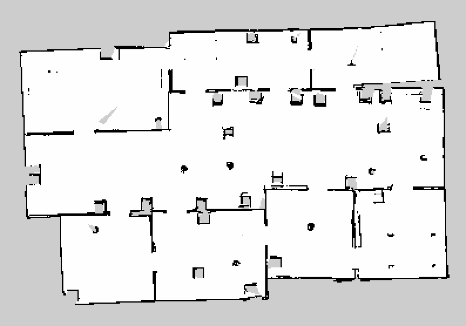

# Home Service Robot

## Project Goals

The goal of the project was to autonomously navigate a robot from a specified pickup location to a drop-off location in
a simulated environment.

## Step 1: Simulation Environment

The simulation has been created in gazebo. It contains several rooms and many features.

\
*Figure 1: Simulated world in gazebo.*

## Step 2: SLAM based Mapping

Run `test_slam.sh` to start the lidar based mapping. Navigate the robot around to build the map. Once the map looks
good, run `rosrun map_server map_saver -f map.yaml` to save the map.

\
*Figure 2: SLAM demo.*

\
*Figure 3: Final map.*

## Step 3: Navigation and Path Planning

The localization is based on a probabilistic algorithm, namely adaptive (or KLD-sampling) Monte Carlo localization,
which uses a particle filter to track the pose of a robot against a known map. The ROS navigation stack creates a path
for the robot while avoiding obstacles. It is based on Dijkstra's algorithm, a variant of the Uniform Cost Search
algorithm.

Run `test_navigation.sh` to manually select navigation goals. Run `pick_objects.sh` to automatically navigate to the
pickup location, wait 5 seconds and navigate to the drop-off location.

\
*Figure 4: Pickup and drop-off locations.*

\
*Figure 5: Navigation demo.*

## A brief description of the used packages

### turtlebot_gazebo

The [turtlebot_gazebo](http://wiki.ros.org/turtlebot_gazebo) package contains launchers to deploy a turtlebot in a
gazebo environment by linking the world file to it.

### turtlebot_rviz_launchers

The [turtlebot_rviz_launchers](http://wiki.ros.org/turtlebot_rviz_launchers) package contains the view_navigation.launch
file to load a preconfigured rviz workspace. It will automatically load the robot model, trajectories, and a map.

### turtlebot_teleop

The [turtlebot_teleop](http://wiki.ros.org/turtlebot_teleop) package provides teleoperation using joysticks or keyboard.

### gmapping (SLAM)

The [gmapping](http://wiki.ros.org/gmapping) package contains a ROS wrapper for OpenSlam's Gmapping. It provides
laser-based SLAM (Simultaneous Localization and Mapping), which will be used to create a 2-D occupancy grid map from
laser and pose data collected by the mobile robot.

### amcl (localization)

The [amcl](http://wiki.ros.org/amcl) package amcl is a probabilistic localization system for a robot moving in 2D. It
implements the adaptive (or KLD-sampling) Monte Carlo localization approach, which uses a particle filter to track the
pose of a robot against a known map.

### move_base (navigation)

The [move_base](http://wiki.ros.org/move_base) package creates a path for the robot while avoiding obstacles on its
path.

### pick_objects (own development)

Package that will send multiple goals for the robot to reach. The robot travels to the desired pickup zone, displays a
message that it reached its destination, waits 5 seconds, travels to the desired drop off zone, and displays a message
that it reached the drop off zone."

### add_markers (own development)

This package will model a virtual object with markers in rviz. Initially it will show the marker at the pickup zone and
hide the marker once the robot reaches the pickup zone. Finally, it will show the marker at the drop off zone once the
robot reaches it.
